# Isochrone Map Generation

### iso (ἴσος) = “equal" / "same”

### chrone (χρόνος) = “time”

  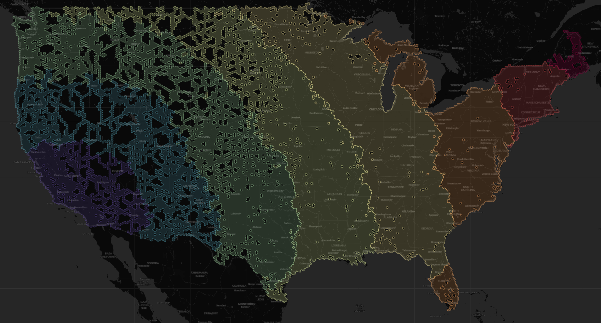
  

    A Isochrone Map of the United States. Isochrones here use Los Angeles, CA as an origin point and show road driving increments of 500 miles.
  

 

An **Isochrone Map** is a visualization displaying the geographic area reachable within a specified time or distance. Real-world data such as road networks, traffic, and public transport schedules are used to map true accessibility (e.g., a 30-minute commute or 2‑day delivery).

---

This tool that can be used to create <u>contental sacle</u> Isochrones with higher <u>percision</u> and <u>resolution</u> than existing resources available online. Methods used here uniquely allow for simulation and analysis of *Over The Road* (OTR) transportation where service is generally provided at a standard distance per day (e.g., 500 or 1000 miles).

### What makes the methods used here unique?

- Scale to continent size
- Maintain High percision and resolution (isochrone borders are accurace within 4.7 miles at resolution 6)
- Not based on a specific carriers geographic service areas
- Not based on historical transit data

### Benefits of these methods

- Ability to generate isochrones for any given city within the continental United States  
- Specify isochrone distance (miles per day)  
- Not based on historical transit data — can plot a proposed or potential origin
- No Google Maps API or other paid resources required  
- No Maintenance of a large "Origin / Destiantion pairing table" required 
- Interactive map (zoom and add other elements)

## Requirements & Setup

### PostGIS Database

A PostGIS database is a SQL database containing coordinates and meta data on all "points" (eg addresses), "lines" (eg roads) and "geometries" (eg buildings) in given geographic area.

#### Steps

1. Install & Postgresql
2. Download a .osm.pbf file here https://download.geofabrik.de (currently only contential united states is supported, download the dataset for North America > United States ~11GB) 
3. Install the following Postgresql Extensions for the database
  - plpgsql
  - hstore
  - postgis
  - pgrouting
4. Use osm2pgsql to load the .osm.pbf file into the database

*Indepth instructions for steps 1-4 can be found online*

  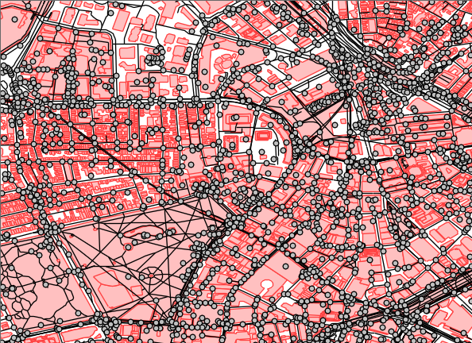
  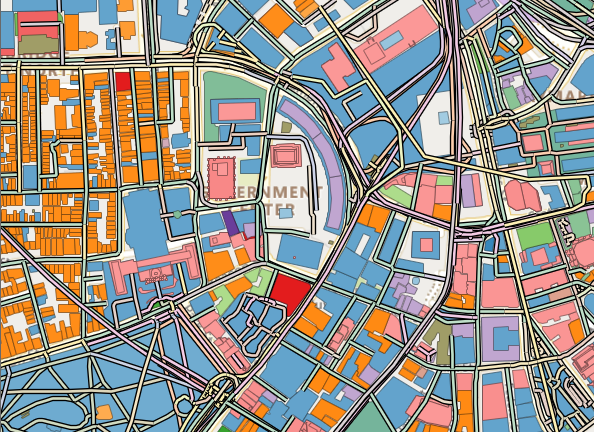

#### Fun Facts
* A PostGIS database can function simmilar to Google Maps but can be run locally/offline/free
* When set up for the United States this database contains 10s of millions of datapoints (~150 GB)
* "PostGIS" = PostgreSQL + Geographic Information Systems

## Appendix

### Methods & Considerations

Generally the methods used here can be summarized into the following steps

#### These Step are run once, "precomputed"
1. Divide a given geographic area (Continential United States) into even sized areas - <u>Cells</u>
2. Identify a <u>road</u> point inside each <u>cell</u>
3. For each <u>cell's</u> <u>road point</u>, measure & log the transit distance to each neighboring <u>cell's</u> <u>road point</u> - <u>Cell Traversal Log</u>

#### These steps are run each time an isochrone map is generated. For a given Isochrone origin & Isochrone increment:
1. Identify which <u>cell</u> contains the <u>origin</u>
2. Use the <u>Cell Traversal Log</u> to find travel distance from the orign cell accross all cells in the given georgaphic area 
3. Group <u>Cells</u> by their <u>Isochrone increment</u> (if the <u>isochrone increment</u> is 500 miles, all cells with a transit distance of 0-499 miles from the origin cell are grouped together, same for all cells at 500-999 miles, etc)
4. Convert each <u>cell group</u> into <u>Polygons</u>
5. Plot the <u>polygons</u> on a <u>map</u>

#### Cells: H3 Hexagons

To Cover a geographic area in relatively even sized cells, a polygon that tiles regularly should be used. Only 3 Polygons tile regularly: Triangles, Hexagons & Squares.

A polygon tiles regularly if there are
- no gaps
- no overlaps
- identical orientation at every vertex (same angle pattern everywhere)

| Hexagon ✅ | Triangle ❌ | Square ❌ |
|----------|---------|----------|
| 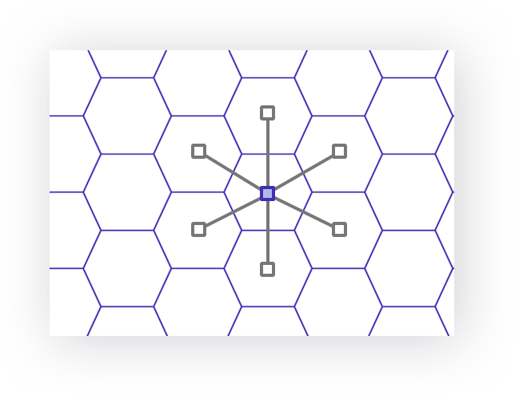 | 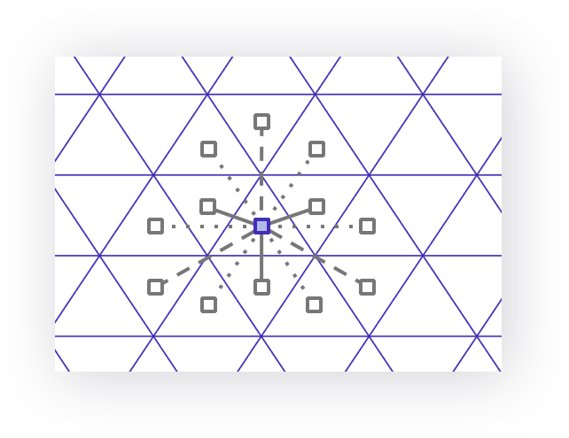 | 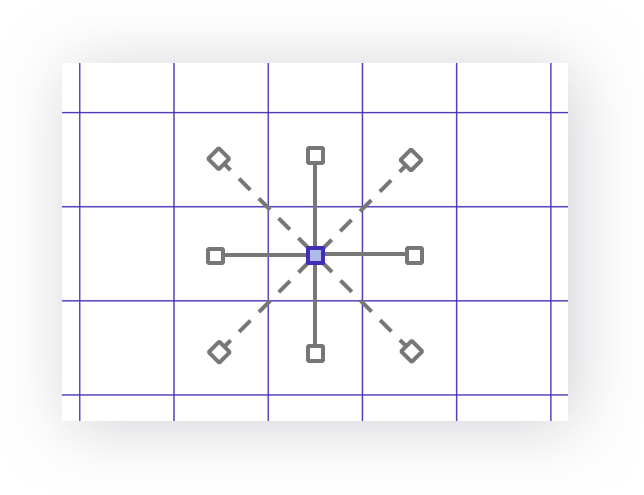 |
| Hexagons have 6 *equidistant* neighbors | Triangles have 12 neighbors | Squares have 8 neighbors |

Because hexagons have the fewest neighbors & only have equidistant neighbors, hexagons allow for the simpliest analysis of 2D movement (Hexagons also look the best)

#### Identifing Road Snapped Points

In each Hexagon "Road Snapped Points" are identified (green dots). When selecting a road snapped point, priority is given to points close to the center of the cell (red dots). There is also some prefrence given to major highways over side roads and neighborhood roads.

  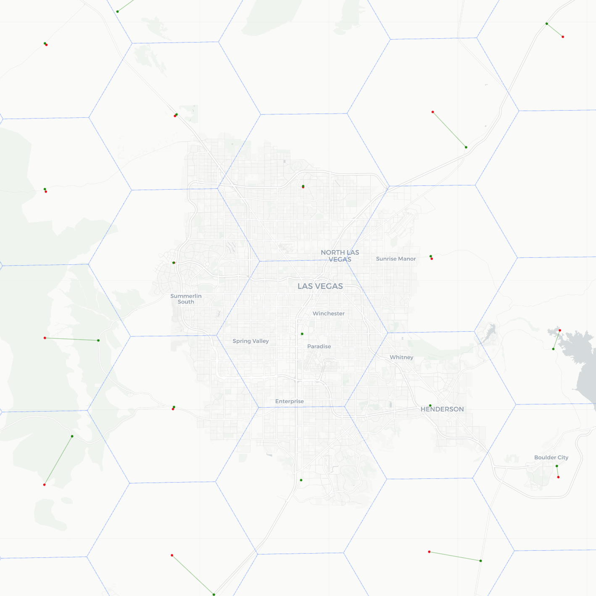

#### Cell to Cell Transit

Once the distance from road snapped point to neighboring road snapped point has been found for all cells, Dijkstra's Algorithm can be used to find the shortest path from an origin cell to all other cells.

  

### Exploring Existing Applictions & Methods

Isochrone maps are most often created for short transit distances, typically intercity transit applications such as city planning, Uber, Zillow, and public transit.

#### Uber – San Francisco 

  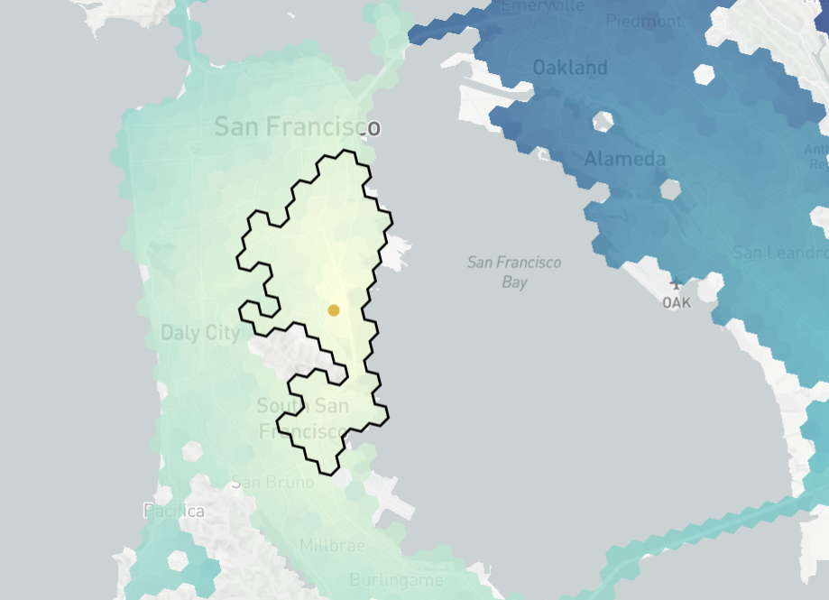
  <!-- 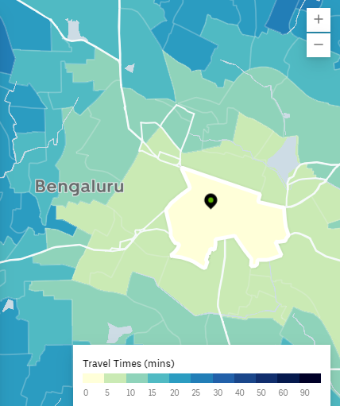 -->

##### Application

- Is there an available driver within 5 minutes of a user?
- Where can a driver travel within 5 min?

#### Zillow - Beaverton

  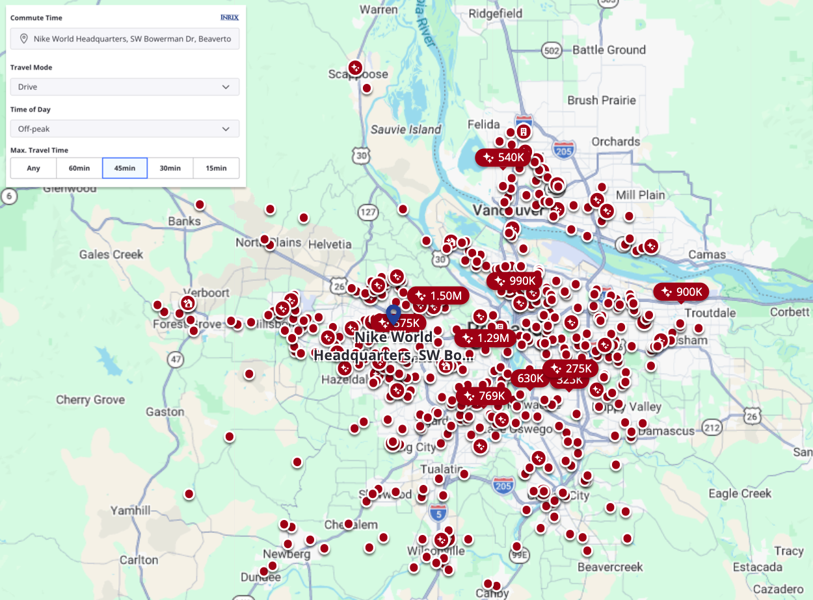

##### Applicaiton

- Users can filter listings based on commute distance

#### Public Transit – London (The Tube)

  

##### Application

- City planners can identify gaps in accessibility of public transit

Note: Precise subway isochrones often show “islands” of accessibility as underground travel can be used to reach isolated pockets that are farther from the origin than geographically closer but unreachable areas (e.g., Hampstead is farther from central London than the London Zoo but can be reached sooner by public transit).

#### Supply Chain Final Mile Delivery - United States

Isochrones can also be generated for greater distances (often with less precision)

  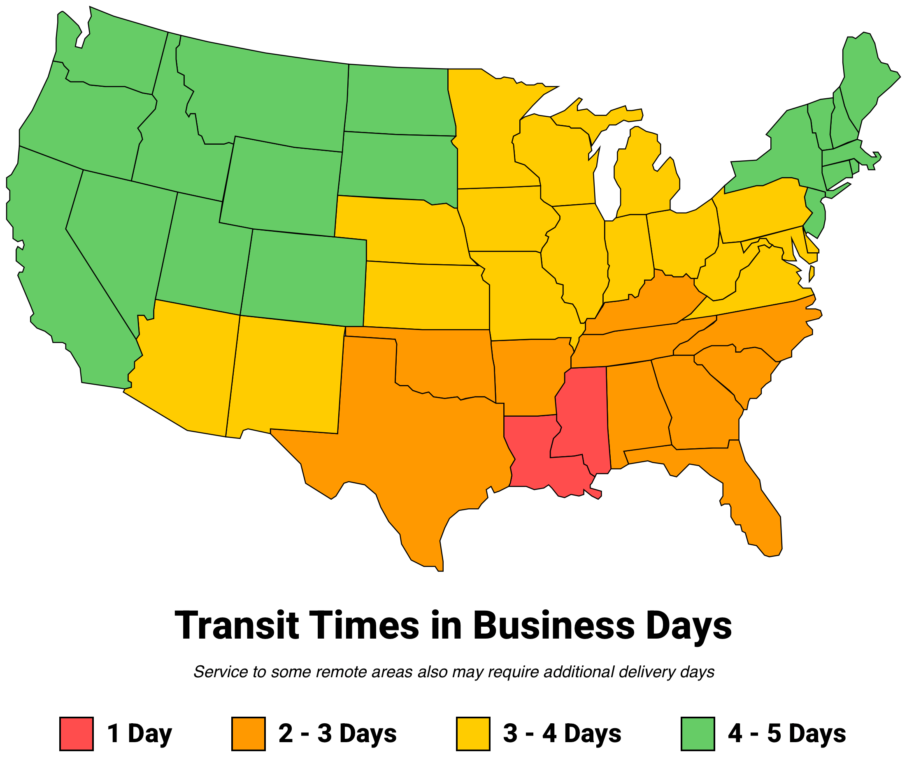
  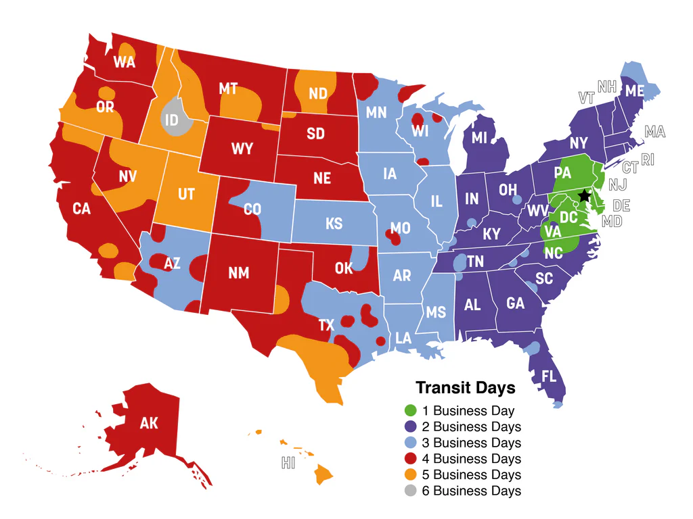
  <!-- 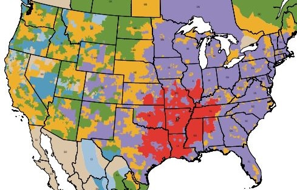 -->

  Precision/Resolution: Low to High

Isochrone lines landing exactly on state borders indicate these isochrones were likely created using estimates or are based on specific third‑party service areas which often extend exactly to state borders or other arbitray boundaries (FedEx/UPS)

#### Limitations of Existing Methods

##### Scaling to continental size

Current methods used to generate isochrones for intercity transit, are too resource intensive to scale to contential size. Isochrone generation tools available online usually allow isochrones up to 60min (3hours max). Current methods to generate larger isochrones rely on specific carriers geographical service areas and/or historical transportation data. These methods are not well suited for simulating large scale logistics networks or testing hypothetical isochrone origin locations. Current methods must trade percision & resolution for larger geographic scale.

  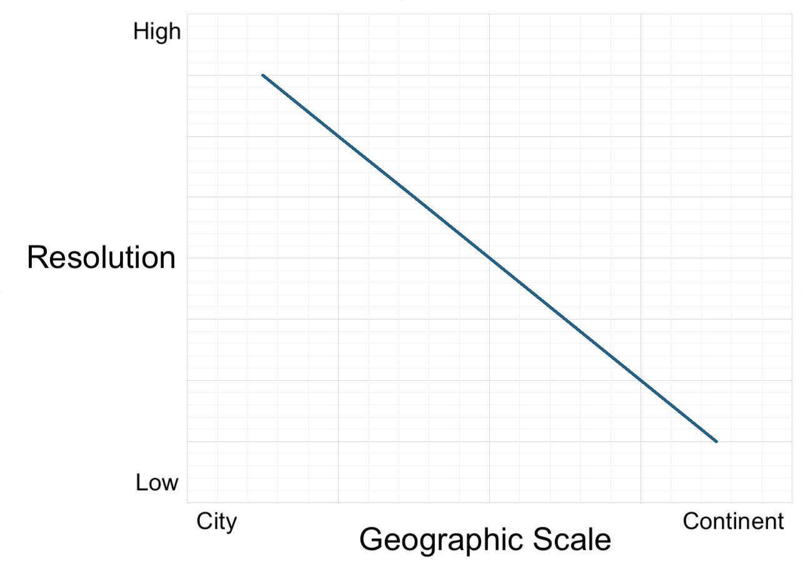

